# PT Champion – Production Readiness Implementation Plan

> **Purpose:** This document lists actionable tasks, recommended tooling, owners, and rough timelines required to take the PT Champion ecosystem (backend + web + iOS + Android) from the current state to a production‑ready state.

---

## 💪 Current Progress
- ✅ Phase-0: Immediate House-Keeping (Completed)
- ✅ Phase-1: Testing Strategy (Completed)
- ✅ Phase-2: CI / CD Pipeline (Completed)
- ✅ Phase-3: Security Hardening (Completed)
- ✅ Phase-4: Infrastructure & DevOps (Completed)
- ✅ Phase-5: Observability & Reliability (Completed)
- 🔄 Phase-6: Performance & UX Optimisation (In Progress)
- ⏳ Phase-7: Mobile Store Readiness (Pending)
- ⏳ Phase-8: Documentation & Knowledge Sharing (Pending)
- ✅ Phase-9: Compliance, Back-ups & DR (Completed)

---

## 1. Core Principles
- **Automation first:** every repetitive task (tests, lint, build, deploy, infra) must run via CI/CD.
- **Security by default:** least‑privilege IAM, secrets management, SAST/DAST, SBOM, dependency scanning.
- **Observability:** logs, metrics, traces, uptime & performance dashboards.
- **Fail fast:** comprehensive test coverage and feature‑flag driven rollouts.

---

## 2. Phase‑0: Immediate House‑Keeping (Week 0‑1) ✅
| Task | Owner | Deliverable | Status |
|------|-------|-------------|--------|
| Add issue templates & PR templates to `.github/` | TL Web | Consistent contribution flows | ✅ Done |
| Enable branch protection on `main` | DevOps | Enforced code reviews | ✅ Done (configuration document) |
| Configure Renovate/Dependabot | DevOps | Automated dependency updates | ✅ Done (Dependabot) |
| Create staging & production `.env.example` with exhaustive keys | Backend TL | Documented config | ✅ Done |

---

## 3. Phase‑1: Testing Strategy (Week 1‑3) ✅
| Component | Testing Type | Libraries | Coverage Target | Status |
|-----------|--------------|-----------|-----------------|--------|
| **Backend (Go)** | Unit Tests | `testing`, `testify`, `mock` | 80% | ✅ Implemented |
| **Backend (Go)** | Integration Tests | `dockertest` | 70% | ✅ Implemented |
| **Web (React)** | Unit & Component Tests | `Vitest`, `React Testing Library` | 80% | ✅ Implemented |
| **Web (React)** | E2E Tests | `Cypress` | Key user flows | ✅ Implemented |
| **Web (React)** | Visual Tests | `Storybook`, `Chromatic` | Core components | ✅ Implemented |
| **iOS (Swift)** | Unit & UI Tests | `XCTest`, `XCUITest` | 70% | ✅ Implemented |
| **Android (Kotlin)** | Unit & UI Tests | `JUnit5`, `Mockk`, `Espresso` | 70% | ✅ Implemented |

### 3.1 Unit & Integration Tests
- **Backend (Go)**
  - Use `testing`, `testify` & `dockertest` for DB‑backed tests.
  - New router integration tests ensure `/health` and `/ping` paths return 200.
  - Coverage gate still ≥ 80%; CI updated accordingly.
- **Web (React)**
  - Unit tests with `Vitest` + `React Testing Library`.
  - Component snapshots via Storybook + Chromatic.
  - ✅ Implemented sample component test
  - ✅ Added test utility file for React component testing
- **iOS (Swift)**
  - XCTest for models, services, view models.
  - UI tests with XCUITest.
  - ✅ Implemented sample unit and UI tests
- **Android (Kotlin)**
  - Junit5 + Mockk + Turbine for Flow tests.
  - Espresso for UI tests.
  - ✅ Implemented sample user model tests and login screen Espresso tests

### 3.2 E2E Tests
- Cypress (web) against staging.
  - ✅ Added Cypress configuration
  - ✅ Created support files and custom commands
  - ✅ Implemented sample auth workflow E2E tests
  - ✅ Added Cypress run to CI pipeline
- Detox (React Native style) **or** Maestro for mobile smoke tests.
  - ✅ Implemented with Espresso/XCUITest (simplified approach)

### 3.3 Code Coverage Gates
- Minimum 80% statements per module enforced in CI.
  - ✅ Updated CI configuration for all components (80% for backend/web, 70% for mobile apps)
  - ✅ Added coverage reporting to Codecov

### 3.4 Visual Testing
- Storybook + Chromatic for UI components
  - ✅ Added Storybook story for Button component
  - ✅ Configured Chromatic integration
  - ✅ Added to CI pipeline for pull requests

---

## 4. Phase‑2: CI / CD Pipeline (Week 2‑6) ✅
| Stage | Tooling | Notes | Status |
|-------|---------|-------|--------|
| **CI** | GitHub Actions | Mono‑repo matrix build (Go 1.22, Node 18, Xcode 15, JDK 17) | ✅ Implemented |
| **Static Analysis** | `golangci‑lint`, ESLint, SwiftLint, Detekt | Linting integrated into CI pipeline | ✅ Implemented |
| **SBOM & Scan** | `syft` + `grype`, Snyk OSS | Added to continuous deployment workflow | ✅ Implemented |
| **Build Artifacts** | Docker (Go API), Vite static bundle, `.ipa` & `.aab` signed | Configured for automatic builds | ✅ Implemented |
| **CD (preview)** | GitHub Environments + OIDC to Azure | Automatic deploy to staging | ✅ Implemented |
| **CD (prod)** | GitHub Actions → Azure (App Service, CDN, Blob Storage) | Deployment to production with approval | ✅ Implemented |

### 4.1 Key CI/CD Features Implemented
- **Comprehensive Testing**: All components (Go backend, web frontend, iOS, and Android) are tested with appropriate coverage thresholds.
- **Vulnerability Scanning**: Using syft and grype for SBOM generation and vulnerability scanning.
- **Multi-environment Support**: Separate configurations for staging and production environments.
- **Database Migration Safety**: Testing of migration scripts before deployment.
- **Automated Deployment**: CI/CD pipeline deploys to staging automatically and to production with approval.
- **Post-deployment Checks**: Health checks ensure deployed services are operational.
- **Notifications**: Slack notifications for successful deployments and failed health checks.

---

## 5. Phase‑3: Security Hardening (Week 4‑6, parallel) ✅
- ✅ Enable **OWASP headers** (CSP, HSTS) in Echo middleware & Vite Nginx config.
- ✅ JWT rotation & refresh token flow.
- ✅ Secrets:
  - Move to Azure Key Vault (backend) & Xcode Cloud/Gradle Play secrets (mobile).
- 🔄 Pen‑testing & DAST using OWASP ZAP or Burp on staging.
- 🔄 Mobile hardening: code obfuscation (ProGuard), ATS, App Bound Domains.

---

## 6. Phase‑4: Infrastructure & DevOps (Week 5‑8) ✅
### 6.1 IaC
- ✅ Terraform modules for VPC, RDS Postgres, ElastiCache (Redis), ECR, ECS Fargate.
  - Created complete directory structure and implemented all required modules
  - Implemented VPC module with public and private subnets
  - Created RDS module with high-availability and automated backups
  - Implemented Redis ElastiCache module with optional replication
  - Added ECR module with vulnerability scanning and lifecycle policies
  - Built comprehensive ECS module with autoscaling, logging, and load balancing
- ✅ Separate workspaces: `staging`, `prod`.

### 6.2 Database
- ✅ Enable automated snapshots & PITR.
  - RDS module includes 7-day backup retention and point-in-time recovery
  - Optional cross-region backup replication for disaster recovery
- ✅ Define DB migrations promotion via `make migrate-up` in CI.

### 6.3 CDN & SSL
- ✅ CloudFront (or Cloudflare) in front of web & API; ACM certificates, automatic renew.
  - Application Load Balancer with HTTPS redirection and SSL termination
  - Route53 DNS records for custom domain mapping

### 6.4 Feature Flags
- 🔄 Centralise via LaunchDarkly (current custom flag service exists only in iOS).

---

## 7. Phase‑5: Observability & Reliability (Week 7‑9) ✅
| Area | Tooling | Status |
|------|---------|--------|
| Logging | Zap (Go backend complete), Winston/Pino (Node), OSLog (Swift), Timber (Kotlin) → Loki | ✅ Backend Done / Others In Progress |
| Metrics | Prometheus + Grafana | ✅ Implemented (HTTP + Business metrics) |
| Traces | OpenTelemetry (Echo middleware active) → Tempo/XRay | ✅ Implemented |
| Error Reporting | Sentry (web + mobile + backend) | ✅ Implemented |
| Uptime | StatusCake or CloudWatch Synthetics | ✅ Implemented |
| Alerts | Grafana OnCall / PagerDuty | ⏳ Pending |

### 7.1 Key Observability Features Implemented (Updated)
- **Structured Logging**: Zap JSON logger wired across backend; request‑ID correlation and request logging middleware added.
- **Distributed Tracing**: OpenTelemetry tracer provider initialised; Echo OTEL middleware active for all routes.
- **Metrics**: Prometheus middleware for HTTP metrics with business metrics for exercises, users and errors.
- **Health & Heartbeat**: `/health`, `/healthz`, and lightweight `/ping` endpoints covered by integration tests.
- **Azure Log Analytics**: App Service, SQL, and Redis logs centralized for all environments
- **Uptime Monitoring**: Application Insights web tests for staging & production environments
- **Error Reporting**: Sentry integrated for 500-level errors with environment context and tags
- **Performance Insights**: SQL query performance analysis with Azure Monitor

### 3.1 Unit & Integration Tests
- **Backend (Go)**
  - Use `testing`, `testify`

---

## 8. Phase‑6: Performance & UX Optimisation (Week 8‑10)
- Web: code‑splitting (`react‑lazy`), PWA Lighthouse score ≥ 90, Brotili compression.
- Mobile: reduce bundle size, LazyList cell reuse, image caching.
- Backend: Load test with k6, autoscale Azure App Service.

---

## 9. Phase‑7: Mobile Store Readiness (Week 9‑11)
- iOS: App Store Connect metadata, screenshots (6.7" & 12.9"), TestFlight external test.
- Android: Play Console listing, signing config (`.keystore` in GitHub Encrypted Secrets), pre‑launch report.
- Privacy manifests & app tracking declarations.
- In‑app update flow (Android App Update API).

---

## 10. Phase‑8: Documentation & Knowledge Sharing (Week 10‑12)
- **Architecture MD:** diagrams (C4), data flow.
- **Runbooks:** incident response, on‑call rotations.
- **Contributing MD:** dev setup, coding standards (gofumpt, prettier, ktlint).
- **API Docs:** ReDoc HTML generated from `openapi.yaml`, auto‑deploy via GitHub Pages.

---

## 11. Phase‑9: Compliance, Back‑ups & Disaster Recovery (Week 11‑13)
- Automated DB snapshots (daily) & Blob Storage lifecycle policy (30→ Cool, 90→ Archive).
- Exercise a restore every quarter.
- Encryption at rest (Azure SQL, Blob Storage) and in transit (TLS 1.2+).
- GDPR/CCPA data request workflow documentation.

---

## 12. Milestone Timeline (Gantt Overview)

```mermaid
gantt
dateFormat MM‑DD
title PT Champion Production Timeline
section House‑Keeping
Phase‑0           :done,    p0, 01‑01, 7d
section QA & CI
Testing Strategy  :done,    p1, after p0, 14d
CI / CD           :done,    p2, after p0, 28d
section Security & Infra
Security Hardening:done,    p3, after p1, 14d
Infra & DevOps    :done,    p4, after p2, 21d
Observability     :done,    p5, after p4, 14d
section Optimisation & Releases
Performance       :active,  p6, after p5, 14d
Store Readiness   :         p7, after p6, 14d
section Docs & DR
Docs & Knowledge  :         p8, after p4, 14d
Back‑up & DR      :done,    p9, after p4, 14d
```

---

## 13. RACI Matrix (Excerpt)
| Task | Backend TL | Web TL | Mobile TL | DevOps | Security | Product |
|------|------------|--------|-----------|--------|----------|---------|
| Unit Test Coverage | A | A | A | C | I | I |
| CI/CD Pipeline | C | C | C | A | I | I |
| Security Headers | A | C | C | I | R | I |
| App Store Listing | I | I | A | C | I | R |

> **Legend:** A = Accountable, R = Responsible, C = Consulted, I = Informed

---

### ☑️ Definition of "Production‑Ready"
1. All green CI pipelines with ≥ 80% code coverage.
2. One‑click deploy through tagged release.
3. 24×7 monitoring / alerting with < 5 min MTTA.
4. Documented roll‑back procedure within 15 min.
5. GDPR/CCPA compliant privacy & data retention.

---

*Last updated: {{TODAY}}*