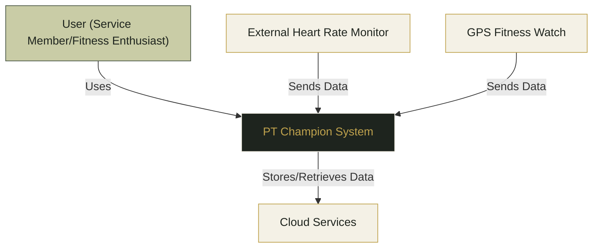
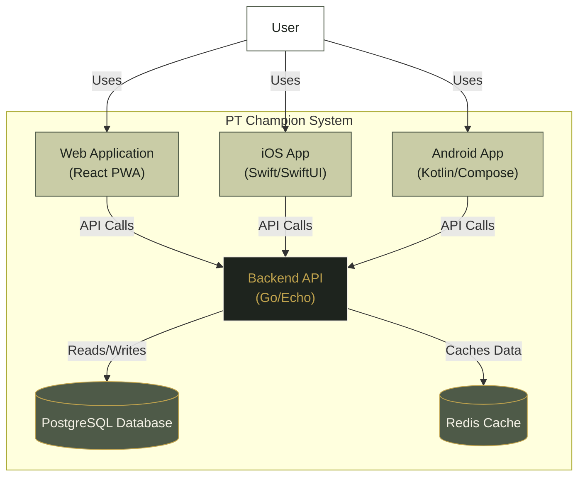
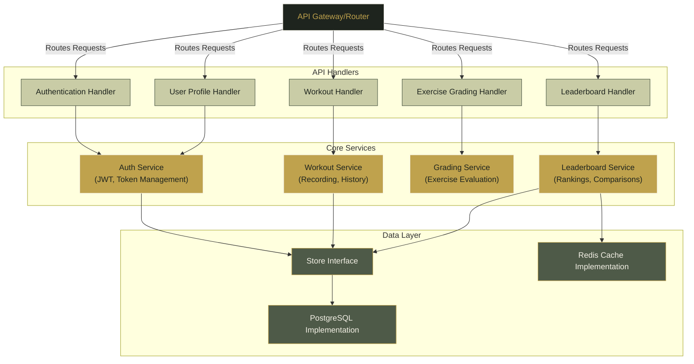
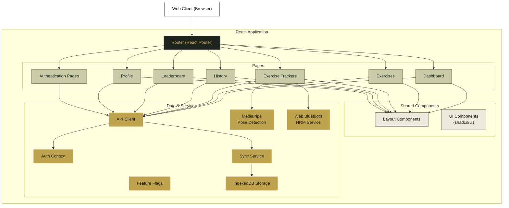
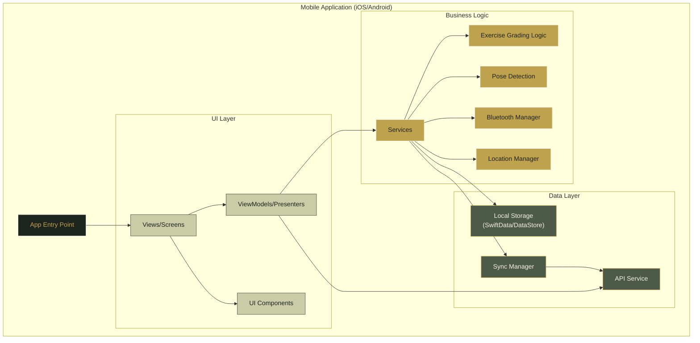
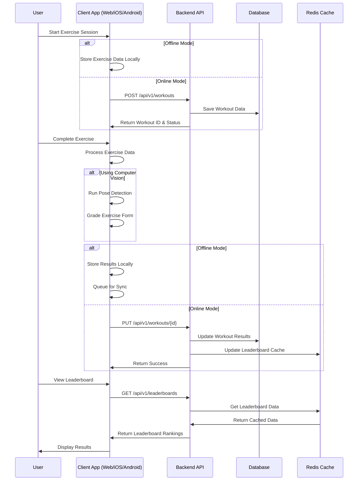
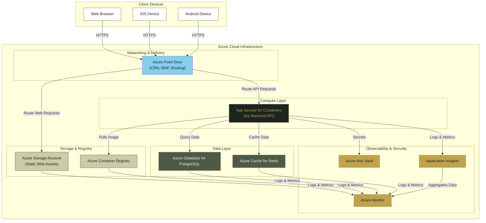

# PT Champion Architecture

This document provides an overview of the PT Champion system architecture using the C4 model (Context, Containers, Components, Code).

## 1. System Context Diagram

The PT Champion system serves users (service members and fitness enthusiasts) who need to track and improve their physical training exercises. The system integrates with external Bluetooth devices like heart rate monitors and GPS watches, and stores data in cloud services.

## 2. Container Diagram

The PT Champion system consists of three main client applications (Web, iOS, and Android) that communicate with a central Go-based API. The API interacts with a PostgreSQL database for persistent storage and Redis for caching (particularly for leaderboard data).

## 3. Component Diagram: Backend API

The backend API is structured with clear separation of concerns:
- API Gateway/Router handles requests and routes them to the appropriate handlers
- Handlers process HTTP requests and delegate business logic to services
- Services contain core business logic
- Data layer abstracts database operations behind interfaces

## 4. Component Diagram: Web Application

The web application is built with React and follows a component-based architecture. It utilizes React Router for navigation, TanStack Query for data fetching, and various services for specific functionalities like pose detection and Bluetooth integration.

## 5. Component Diagram: Mobile Applications

Both iOS and Android applications follow similar architectural patterns with platform-specific implementations:

The mobile applications use MVVM architecture with platform-specific implementations:
- iOS: SwiftUI for UI, Combine/Swift Concurrency for async operations, SwiftData for local storage
- Android: Jetpack Compose for UI, Coroutines for async operations, Room/DataStore for local storage

## 6. Data Flow Diagram

This sequence diagram illustrates how data flows through the system during typical exercise tracking, showing both online and offline scenarios, and the synchronization process.

## 7. Deployment Architecture (Azure)

The PT Champion system is deployed on Microsoft Azure using a suite of managed services:
- **Azure Front Door**: Provides global HTTP load balancing, CDN capabilities, WAF protection, and custom domain management. It routes traffic to the appropriate backend services.
- **Azure Storage Account**: Hosts the static files for the React web application (PWA), configured for static website hosting.
- **Azure App Service for Containers**: Runs the Go backend API as a containerized application, likely using the image stored in ACR.
- **Azure Container Registry (ACR)**: Stores and manages the Docker images for the backend API.
- **Azure Database for PostgreSQL - Flexible Server**: Provides a managed PostgreSQL database service.
- **Azure Cache for Redis**: Used for caching leaderboard data and potentially session management.
- **Azure Key Vault**: Securely stores application secrets like API keys and database credentials.
- **Azure Monitor & Application Insights**: Provide comprehensive monitoring, logging, tracing, and alerting for the application and infrastructure components.

## 8. Security Architecture

```mermaid
graph TD
    subgraph "Security Layers"
        NetSec["Network Security"]
        DataSec["Data Security"]
        AuthSec["Authentication Security"]
        AppSec["Application Security"]
    end
    
    subgraph "Network Security"
        TLS["TLS 1.2+"]
        WAF["Web Application Firewall"]
        CORS["CORS Policy"]
        SecHeaders["Security Headers"]
    end
    
    subgraph "Data Security"
        EncRest["Encryption at Rest"]
        EncTransit["Encryption in Transit"]
        DataMin["Data Minimization"]
    end
    
    subgraph "Authentication Security"
        JWT["JWT with Refresh"]
        SecStorage["Secure Token Storage"]
        PassHash["Password Hashing (Argon2)"]
    end
    
    subgraph "Application Security"
        InputVal["Input Validation"]
        CSRF["CSRF Protection"]
        DepScan["Dependency Scanning"]
        SAST["Static Analysis"]
    end
    
    NetSec -->|Implements| TLS
    NetSec -->|Implements| WAF
    NetSec -->|Implements| CORS
    NetSec -->|Implements| SecHeaders
    
    DataSec -->|Implements| EncRest
    DataSec -->|Implements| EncTransit
    DataSec -->|Implements| DataMin
    
    AuthSec -->|Implements| JWT
    AuthSec -->|Implements| SecStorage
    AuthSec -->|Implements| PassHash
    
    AppSec -->|Implements| InputVal
    AppSec -->|Implements| CSRF
    AppSec -->|Implements| DepScan
    AppSec -->|Implements| SAST
    
    classDef layer fill:#1E241E,color:#BFA24D,stroke:#F4F1E6
    classDef sec fill:#C9CCA6,color:#1E241E,stroke:#4E5A48
    
    class NetSec,DataSec,AuthSec,AppSec layer
    class TLS,WAF,CORS,SecHeaders,EncRest,EncTransit,DataMin,JWT,SecStorage,PassHash,InputVal,CSRF,DepScan,SAST sec
```

The PT Champion system implements a layered security approach covering network, data, authentication, and application layers with specific security controls in each layer.

## Technology Stack Summary

### Backend
- **Language**: Go 1.22
- **Web Framework**: Echo
- **ORM**: sqlc (SQL code generation)
- **Database**: PostgreSQL
- **Caching**: Redis
- **API Design**: OpenAPI 3.0
- **Authentication**: JWT with refresh tokens

### Web Frontend
- **Language**: TypeScript
- **Framework**: React
- **Build Tool**: Vite
- **Styling**: Tailwind CSS + shadcn/ui
- **State Management**: TanStack Query (React Query)
- **Offline Storage**: IndexedDB
- **PWA Features**: Service Workers, Background Sync
- **Computer Vision**: MediaPipe Tasks Vision
- **Bluetooth**: Web Bluetooth API

### iOS
- **Language**: Swift
- **UI Framework**: SwiftUI
- **Architecture**: MVVM
- **Local Storage**: SwiftData
- **Vision Processing**: Apple Vision framework
- **Bluetooth**: CoreBluetooth

### Android
- **Language**: Kotlin
- **UI Framework**: Jetpack Compose
- **Architecture**: MVVM + Clean Architecture
- **Local Storage**: DataStore
- **Vision Processing**: MediaPipe
- **Bluetooth**: Android Bluetooth LE API

### Infrastructure & DevOps
- **Cloud Provider**: Azure
- **IaC**: Terraform
- **Container Orchestration**: ECS Fargate
- **CI/CD**: GitHub Actions
- **Monitoring**: CloudWatch, X-Ray, Grafana
- **Security Scanning**: Snyk, grype/syft, pre-commit hooks 